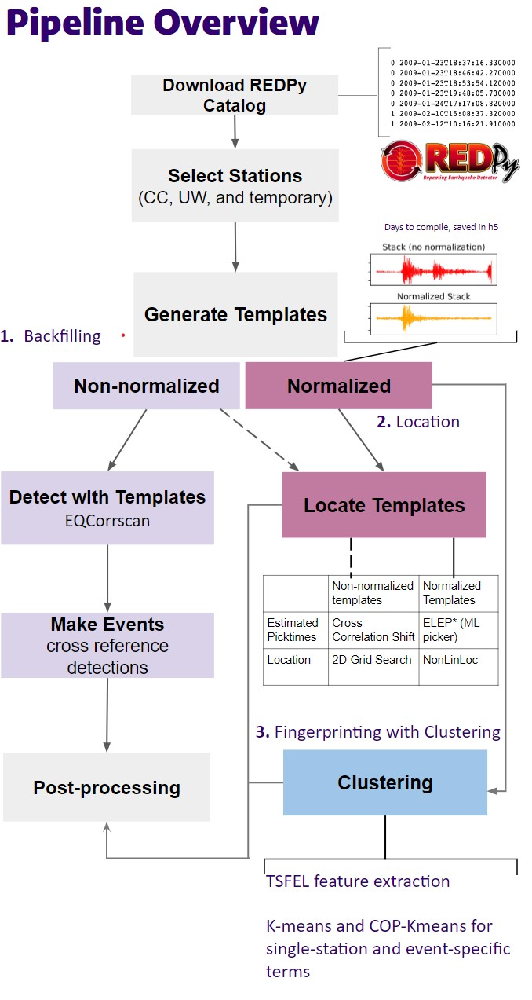

# Expanding and Fingerprinting a Repeating Earthquake Catalog on the Cascades Volcanoes

We look at the REDPy <a href="https://github.com/ahotovec/REDPy">(Repeating Earthquake Detector in Python - Alicia Hotovec-Ellis software)</a> catalog on five Cascades Volcanoes (Mt Rainier, Mt St Helens, Mt Hood, Mt Baker, Newberry Volcano). Because REDPy catalogs only have cluster ID and guessed origin time, we aim to do 3 things:

1. Backfill the REDPy catalog with template matching from 2002-2009
2. Locate the events 
3. Fingerprint events using clustering

We use eqcorrscan <a href="https://www.dropbox.com/s/rscu5odvn1bbr2s/Chamberlain18.pdf?dl=0">(Chamberlain et al, 2018)</a>  and the Fast Matched Filter <a href="https://doi.org/10.1785/0220170181">(Beauce and Frank, 2018)</a> to run template matching on GPUs.

<h2>Methods/Process</h2>
We select stations with make_volcano_metadata.ipynb, generate templates in make_templates.ipynb, locate templates in template_locations.ipynb, detect with templates in find_detections.ipynb, make events in find_events.ipynb, and do post processing in remove_redpy_overlap.ipynb.

<h2>Understanding the Repo</h2>
<table>
  <tr>
    <th>Filename(s)</th>
    <th>Directory</th>
    <th>Description</th>
  </tr>
  <tr>
    <td>Baker_catalog.txt, Hood_catalog.txt, MountStHelens_catalog.txt, MSHborehole_catalog.txt, MSHlocal_catalog.txt, Newberry_catalog.txt, Rainier_catalog.txt</td>
    <td>txt_catalogs/</td>
    <td>REDPy catalogs as they were downloaded</td>
  </tr>
  <tr>
    <td>Baker_catalog.csv, Hood_catalog.csv, MountStHelens_catalog.csv, MSHborehole_catalog.csv, MSHlocal_catalog.csv, Newberry_catalog.csv, Rainier_catalog.csv</td>
    <td>csv_catalogs/</td>
    <td>REDPy catalogs as CSVs with column titles</td>
  </tr>
  <tr>
    <td>Volcano_Metadata.csv</td>
    <td>csv_catalogs/</td>
    <td>Contains metadata for stations used on all volcanoes, created in make_volcano_metadata</td>
  </tr>
  <tr>
    <td>make_volcano_metadata.ipynb</td>
    <td>notebooks/</td>
    <td>Queries IRIS for station metadata in a certain radius of volcano center and sorts through to find useful stations, creates Volcano_Metadata.csv</td>
  </tr>
  <tr>
    <td>make_templates.ipynb</td>
    <td>notebooks/</td>
    <td>Pulls waveforms from stations in Volcano_Metadata, stacks them, and creates template from stack. Creates .tgz files of station templates.</td>
  </tr>
  <tr>
    <td>template_locations.ipynb</td>
    <td>notebooks/</td>
    <td>Finds template locations with gridsearch model. Arrivals are estimated by cross correlation shift. Saves to CSV.</td>
  </tr>
  <tr>
    <td>find_detections.ipynb</td>
    <td>notebooks/</td>
    <td>Runs templates across each station 2002-2021 to find detections. Creates CSVs of detections.</td>
  </tr>
  <tr>
    <td>find_events.ipynb</td>
    <td>notebooks/</td>
    <td>Looks at detection CSVs to check overlap in cluster and time to at minsta (minimum number of stations, varies by volcano) stations find events. Creates 1 CSV per volcano per year.</td>
  </tr>
  <tr>
    <td>remove_redpy_overlap.ipynb</td>
    <td>notebooks/</td>
    <td>Looks at event CSVs to remove events +-15 s from REDPy catalog times of the same cluster. These are assumed to be REDPy events. Adds Locations from CSV (created in template_locations.ipynb) to create final output catalogs of backfilled events.</td>
  </tr>
  <tr>
    <td>eq_clustering.ipynb</td>
    <td>notebooks/</td>
    <td>Clustering templates with EQcorrscan's cluster() function. In progress.</td>
  </tr>
  <tr>
    <td>templates_to_h5.ipynb</td>
    <td>notebooks/</td>
    <td>Creates h5 versions of templates. In progress. May not be used in the future.</td>
  </tr>
  <tr>
    <td>config.yaml</td>
    <td>scripts/</td>
    <td>Config file to be able to change parameters on mulitple notebooks at the same time. Contains descriptions and values of important variables.</td>
  </tr>
  <tr>
    <td>find_events.py, template_locations_.py</td>
    <td>scripts/</td>
    <td>Scripts of notebooks find_events.ipynb and template_locations.ipynb for running.</td>
  </tr>
  <tr>
    <td>bias_plot.png</td>
    <td>/</td>
    <td>Plot of station duration 2002-2021. Shows temporal bias. Created in bias_plot.ipynb</td>
  </tr>
  <tr>
    <td>bias_plot.ipynb</td>
    <td>notebooks/plots/</td>
    <td>Finds and plots station duration 2002-2021 to show temporal bias. Creates bias_plot.png</td>
  </tr>
  <tr>
    <td>calculations.ipynb</td>
    <td>notebooks/plots/</td>
    <td>Estimates some numbers like number of waveforms used to make templates or total number of cross correlations.</td>
  </tr>
  <tr>
    <td>events_per_day.ipynb</td>
    <td>notebooks/plots/</td>
    <td>Creates plot of events per day 2002-2022 for REDPy events, backfilled events, and PNSN events in same area.</td>
  </tr>
  <tr>
    <td>plotting_locations.ipynb</td>
    <td>notebooks/plots/</td>
    <td>Creates DEM plot of REDPy template locations, PNSN events in same area, stations used for volcano, and volcano center.</td>
  </tr>
  <tr>
    <td>test_and_wave_compare.ipynb</td>
    <td>notebooks/plots/</td>
    <td>Creates plots to look at similarity of waveforms. Also used for visual testing. Has not been updated in a while.</td>
  </tr>
  <tr>
    <td>download_streams.ipynb</td>
    <td>notebooks/tutorials/</td>
    <td>Tutorial notebook for downloading obspy streams. Not currently used.</td>
  </tr>
  <tr>
    <td>reading_DEM.ipynb</td>
    <td>notebooks/tutorials/</td>
    <td>Tutorial notebook for aquiring and plotting DEM dat.</td>
  </tr>
  <tr>
    <td>reading_templates.ipynb</td>
    <td>notebooks/tutorials/</td>
    <td>Tutorial notebook for reading .tgz files and working with templates.</td>
  </tr>
</table>
